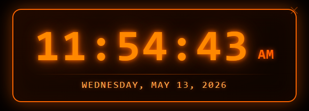

# Orange Clock

A frameless desktop clock app built with Electron. Features a glowing orange digital display with the current time and date.




## Features

- Large digital time display (12-hour format with AM/PM)
- Full date display (day, month, date, year)
- Glowing orange theme on a dark background
- Frameless transparent window — drag anywhere to reposition
- Minimal close button (✕)

## Requirements

- [Node.js](https://nodejs.org/) v18+

## Getting Started

```bash
npm install
npm start
```

## Project Structure

```
orange-clock/
├── main.js        # Electron main process (window config)
├── index.html     # UI layout and styles
├── renderer.js    # Clock logic (time/date updates)
└── package.json
```

## License

MIT
